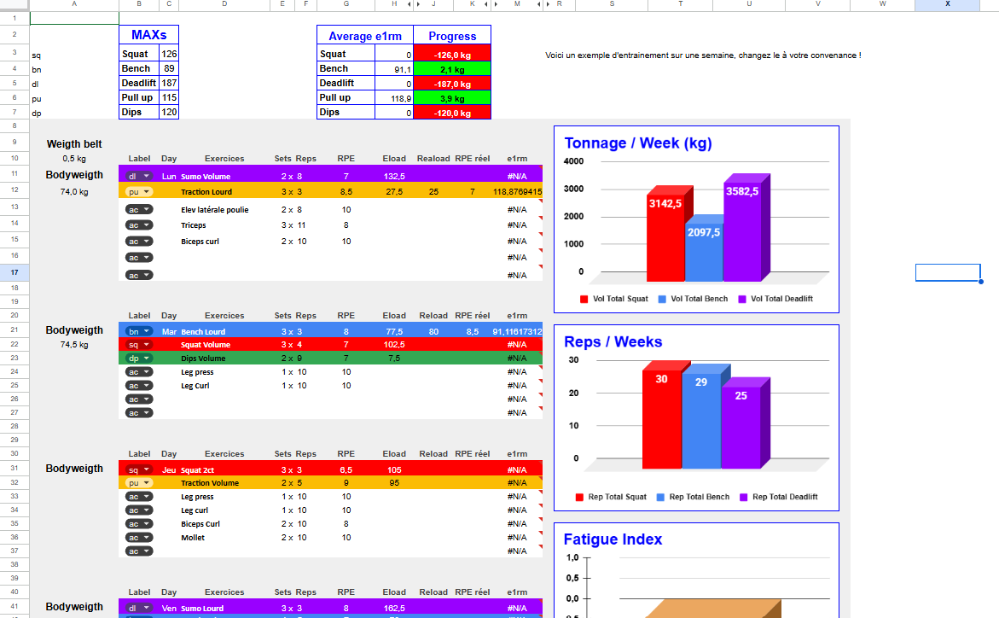

# 🏋️ PowerLift Tracker

[](https://github.com/BnRomain/PowerLiftingTracker/actions/workflows/docs.yml)
[](https://github.com/BnRomain/PowerLiftingTracker/actions/workflows/github-code-scanning/codeql)
[](https://github.com/BnRomain/PowerLiftingTracker/releases)
[](LICENSE)
[](https://docs.google.com/spreadsheets/d/1cMEQfgsgYV3C5RC8sq0Xvccz4UgO5aT8dhn19qVybdU/edit?usp=sharing)

A powerlifting tracker built on **Google Sheets**. It estimates your e1RM from the RPE chart, plans your loads from it, updates your reference MAXs every week from your actual performance and measures your accumulated fatigue, over a 10-week block.

**[Get the template](https://docs.google.com/spreadsheets/d/1cMEQfgsgYV3C5RC8sq0Xvccz4UgO5aT8dhn19qVybdU/edit?usp=sharing)** · [User guide](docs/user-guide.md) · [Guide d'utilisation (FR)](docs/user-guide-fr.md) · [Wiki](https://github.com/BnRomain/PowerLiftingTracker/wiki)

## 📸 Preview



## 🎯 The Problem

As a powerlifter, I needed a tool to:

- **plan sessions** precisely (loads, reps, RPE);
- **track progression** on the main lifts (squat, bench press, deadlift);
- **adjust loads automatically** from actual performance;
- **detect accumulated fatigue** to manage recovery.

Existing apps lacked customization and did not account for details such as the bodyweight in weighted pull-ups and dips.

## ✨ Features

### 📊 e1RM from the RPE chart

- Estimated one-rep max (**e1RM**) computed from the load, the reps and the RPE of each set, with the RPE chart
- Weighted pull-ups and dips include the bodyweight and the belt weight

### 🎯 Load planning

- Planned load (**Eload**) computed from your reference MAX and the percentage of the RPE chart
- Rounded to the nearest 2.5 kg, to match gym plates
- For pull-ups and dips, the Eload only shows the weight to hang on the belt

### 📈 Progression tracking

- Weekly average e1RM for each lift, which becomes the reference MAX of the next week: no copy-paste between weeks
- Week-to-week progress, in kg and %
- Total tonnage (load × reps) and total reps per lift

### 🔥 Fatigue index

- `Actual RPE - Planned RPE` for every set, averaged over the week
- **Positive**: accumulated fatigue; **negative**: good form; **around 0**: on plan

### ⚖️ Bodyweight

- Bodyweight logged at each session, with a weekly average that ignores empty cells
- Used in the pull-up and dip calculations

### 📉 Charts

- e1RM of the squat, bench press and deadlift, and SBD total over the weeks
- e1RM of the pull-ups and dips, and bodyweight over the weeks
- Weekly tonnage, reps and fatigue index

## 🛠️ How It Works

The tracker only uses built-in Google Sheets formulas (`ARRAYFORMULA`, `AVERAGEIF`, nested `IF`, `IFERROR`, `ISNUMBER`), conditional formatting and charts.

### Spreadsheet structure

```text
PowerLift Tracker
│
├── Week sheets (1 to 10)
│   ├── Week info
│   │   ├── Reference MAXs (squat, bench, deadlift, pull-ups, dips)
│   │   ├── Average bodyweight
│   │   └── Average e1RM and progress
│   │
│   ├── Sessions (Mon, Tue, Thu, Fri, Sun)
│   │   ├── Exercise label and name
│   │   ├── Sets × reps
│   │   ├── Planned RPE / actual RPE
│   │   ├── Eload (planned load) / Reload (actual load)
│   │   ├── e1RM
│   │   └── Fatigue index
│   │
│   └── Charts
│       ├── Tonnage per week
│       ├── Reps per week
│       └── Fatigue index
│
└── "Suivi e1RM" sheet (multi-week tracking)
    ├── Week | Date | squat, bench, deadlift, pull-ups and dips e1RM
    ├── SBD total chart
    ├── Pull-ups and dips chart
    └── Bodyweight chart
```

### Key formulas

#### e1RM, with the bodyweight for pull-ups and dips

```excel
=IF(OR(B12="pu",B12="dp"),((J12+A12)*100)/L12,(J12*100)/L12)
```

- Divides the actual load (Reload, column J) by the actual intensity given by the RPE chart (column L).
- For pull-ups (`pu`) and dips (`dp`), the bodyweight of the session (column A) is added to the load. The template also adds the belt weight (cell A10), left out here for readability.

#### Weekly average e1RM, ignoring empty cells

```excel
=ROUND(ArrayFormula(IFERROR(AVERAGE(IF($B$11:$B$57="sq",
IF(ISNUMBER($M$11:$M$57),$M$11:$M$57))),"")),1)
```

- Filters the sets by exercise label, ignores `#N/A` and empty cells, and rounds to 1 decimal.

#### Fatigue index

```excel
=IF(AND(K11<>"",ISNUMBER(K11)),K11-E11,"")
```

- Difference between the actual RPE and the planned RPE, left empty until the set is logged.

## 📊 Usage Example

Monday, deadlift session:

1. Reference deadlift e1RM: **190 kg**
2. Planned set: sumo deadlift 2 × 7 @ RPE 7, that is 73.9 % of the e1RM: the Eload is **140 kg**
3. Performed: 2 × 7 @ **135 kg**, a bit lighter than planned
4. Actual RPE: **7**, as planned
5. e1RM: **182.7 kg** (135 kg / 0.739)
6. Fatigue index: **0** (7 - 7)

At the end of the week, the average of the two deadlift sessions (for example **187.3 kg**) automatically becomes the reference MAX of the next week.

## 🚀 Getting Started

Prerequisites: a Google account and a basic understanding of powerlifting and RPE.

1. **Open the template**: [Google Sheets template](https://docs.google.com/spreadsheets/d/1cMEQfgsgYV3C5RC8sq0Xvccz4UgO5aT8dhn19qVybdU/edit?usp=sharing)
2. **Make a copy**: File > Make a copy
3. **Fill in your current MAXs** in the "MAXs" section (cells C3 to C7)
4. **Enter your bodyweight** in column A for each session, and your belt weight in cell A10
5. **Plan your week**: label, exercise, sets, reps and planned RPE
6. **Log your sets**: actual load (Reload) and actual RPE
7. **Analyze**: e1RM, progress and fatigue index are computed automatically

From week 2, the MAXs are updated from the average e1RM of the previous week: just repeat steps 5 to 7. The [user guide](docs/user-guide.md) details every column and rule.

## 📖 Documentation

- **[User guide (English)](docs/user-guide.md)**: setup, RPE chart, sessions, bodyweight exercises, analysis and FAQ
- **[Guide d'utilisation (French)](docs/user-guide-fr.md)**: the same guide in French
- **[Wiki](https://github.com/BnRomain/PowerLiftingTracker/wiki)**: project overview, how it works and CI/CD
- **[Changelog](CHANGELOG.md)**: version history

## 🗂️ Repository Structure

```text
PowerLiftingTracker/
├── docs/
│   ├── user-guide.md         user guide (English)
│   ├── user-guide-fr.md      user guide (French)
│   └── images/               screenshots of the template
├── .github/                  workflows, issue and pull request templates, Dependabot
├── .markdownlint-cli2.yaml   Markdown lint configuration
├── CHANGELOG.md              version history
├── CITATION.cff              citation metadata
├── CODE_OF_CONDUCT.md        code of conduct
├── CONTRIBUTING.md           contributing guide
├── LICENSE                   MIT License
└── SECURITY.md               security policy
```

The spreadsheet itself lives in Google Drive: the repository holds its documentation and the project automation.

## ✅ Quality and Automation

On every pull request and every push to `main`, GitHub Actions runs:

- **Documentation**: markdownlint on every Markdown file, then lychee checks that every link to a file, heading anchor and image resolves;
- **Dependency review**: blocks a pull request that adds a vulnerable dependency;
- **CodeQL**: security analysis of the GitHub Actions workflows.

The `main` branch is protected: every change goes through a pull request and can only be merged once these checks pass. Secret scanning with push protection blocks any committed credential.

Versions follow [Semantic Versioning](https://semver.org/) and are published as [GitHub releases](https://github.com/BnRomain/PowerLiftingTracker/releases): see the [contributing guide](CONTRIBUTING.md#versioning-and-releases).

**Dependabot** monitors the GitHub Actions. Patch and minor updates are merged automatically once the required checks of `main` have passed. See also the [security policy](SECURITY.md).

## 📈 Roadmap

### Available

- ✅ Session planning and logging
- ✅ Automatic e1RM calculation
- ✅ Fatigue index
- ✅ 10-week progression tracking
- ✅ Weighted pull-ups and dips

### Ideas

- [ ] Migration to a React + Firebase web app
- [ ] Progress predictor ("you will reach X kg in Y weeks")
- [ ] Comparison with strength standards (beginner, intermediate, advanced, elite)
- [ ] Deload suggestion based on a fatigue threshold
- [ ] PDF export of the weekly program
- [ ] Mobile application
- [ ] Exercise video library
- [ ] Community leaderboards
- [ ] AI-powered form analysis

## 🎓 Learning Resources

- [RPE and autoregulation explained](https://www.strongerbyscience.com/autoregulation/) (Stronger By Science)
- [Powerlifting programs](https://www.powerliftingtowin.com/powerlifting-programs/) (Powerlifting to Win)

## 🙏 Acknowledgments

- **RPE chart** methodology based on the work of Mike Tuchscherer
- **Programming principles** inspired by Juggernaut Training Systems
- Thanks to all the beta testers who helped refine the tracker

## 🤝 Contributing

Contributions are welcome. Please read the [contributing guide](CONTRIBUTING.md) and the [code of conduct](CODE_OF_CONDUCT.md) before opening an issue or a pull request. Questions and training results are welcome in [Discussions](https://github.com/BnRomain/PowerLiftingTracker/discussions), and security vulnerabilities must be reported privately, as described in the [security policy](SECURITY.md).

## 📜 License

This project is released under the [MIT License](LICENSE).

## 📚 Citation

To cite this project, use the metadata in [`CITATION.cff`](CITATION.cff) or the "Cite this repository" button on GitHub.

## 📧 Contact

**Romain Ben**: [romainben31@gmail.com](mailto:romainben31@gmail.com) · [LinkedIn](https://www.linkedin.com/in/romainben/) · [GitHub](https://github.com/BnRomain)
