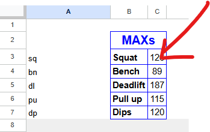
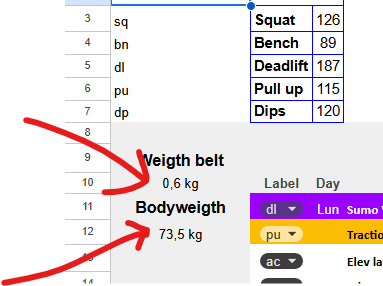
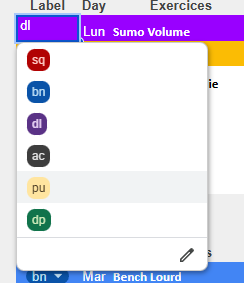
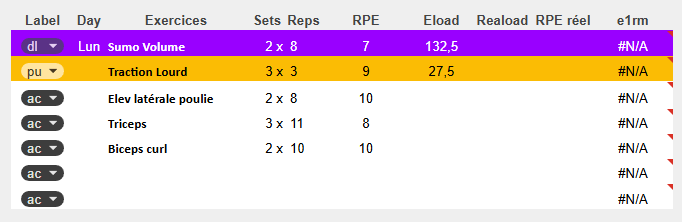
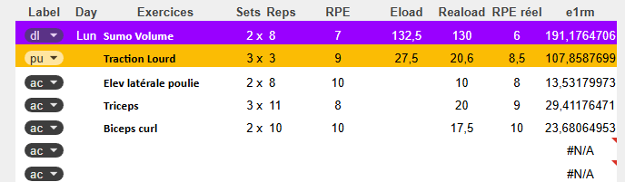
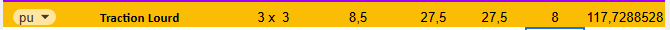
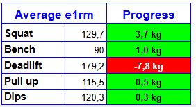
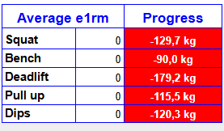

# 📘 Guide d'utilisation de PowerLift Tracker

Aussi disponible en anglais : [user guide](user-guide.md).

## 📋 Table des matières

1. [Introduction](#1-introduction)
2. [Configuration initiale](#2-configuration-initiale)
3. [Comprendre le RPE Chart](#3-comprendre-le-rpe-chart)
4. [Remplir une séance](#4-remplir-une-séance)
5. [Exercices au poids de corps](#5-exercices-au-poids-de-corps)
6. [Analyser ses performances](#6-analyser-ses-performances)
7. [Le suivi multi-semaines](#7-le-suivi-multi-semaines)
8. [Règles importantes](#8-règles-importantes)
9. [FAQ](#9-faq)

---

## 1. Introduction

Bienvenue dans **PowerLift Tracker** ! Ce système vous permet de suivre votre progression en powerlifting de manière intelligente et automatisée.

**Ce que fait l'outil :**

- Calcule automatiquement vos e1RM (1 Rep Max estimés)
- Ajuste vos charges d'entraînement selon votre progression
- Analyse votre niveau de fatigue
- Suit votre évolution sur 10 semaines

---

## 2. Configuration initiale

### Étape 1 : Remplir vos MAX actuels

Dans la section **"MAXs"** (cellules **C3 à C7**), entrez vos e1RM de référence pour chaque mouvement principal :

| Exercice | Cellule | Exemple |
| --- | --- | --- |
| Squat | C3 | 126 kg |
| Bench | C4 | 89 kg |
| Deadlift | C5 | 187 kg |
| Pull-ups | C6 | 115 kg |
| Dips | C7 | 120 kg |



**💡 Important :**

- Pour Pull-ups et Dips, entrez le **poids total** (votre poids + lest habituel)
- Si vous ne connaissez pas vos MAX, estimez-les de manière conservatrice

### Étape 2 : Remplir votre bodyweight

Le bodyweight est séparé des MAX et se remplit à chaque séance. Pensez à remplir le poids de votre ceinture de lest en A10.

#### Bodyweight par séance (colonne A)

Dans la colonne **A** (cellules A12, A22, A32, A42, A52), entrez votre poids de corps pour chaque jour d'entraînement :

| Séance | Cellule | Exemple |
| --- | --- | --- |
| Lundi | A12 | 73,5 kg |
| Mardi | A22 | 73,9 kg |
| Jeudi | A32 | 73,2 kg |
| Vendredi | A42 | 73,5 kg |
| Dimanche | A52 | 74,2 kg |



**💡 Notes importantes :**

- **Pas obligatoire de remplir toutes les séances** : Le système calcule la moyenne uniquement sur les cellules remplies. Si vous ne remplissez que 3 bodyweights sur 5 séances, la moyenne sera calculée sur ces 3 valeurs.
- **Pas de balance disponible ?** Vous pouvez mettre une **estimation** de votre poids quotidien. Même si c'est moins précis, ça fait largement l'affaire pour les calculs de Pull-ups et Dips.

#### Bodyweight moyen de la semaine (A60)

- Calculé **automatiquement** à partir des bodyweights quotidiens remplis
- Utilisé comme référence générale et pour le suivi de l'évolution de votre poids
- Ignore les cellules vides

**Exemple :**

```text
A12: 73,5 kg
A22: (vide - séance ratée)
A32: 73,2 kg
A42: 73,5 kg
A52: (vide - pas pesé)
→ Bodyweight moyen (A60) = (73,5 + 73,2 + 73,5) / 3 = 73,4 kg
```

---

## 3. Comprendre le RPE Chart

### Qu'est-ce que le RPE ?

**RPE** = Rate of Perceived Exertion (Taux d'Effort Perçu)

C'est une échelle de **5 à 10** qui mesure la difficulté d'une série :

| RPE | Signification | Reps en réserve (RIR) |
| --- | --- | --- |
| 10 | Échec complet | 0 RIR |
| 9,5 | Presque l'échec | 0,5 RIR |
| 9 | 1 rep de plus possible | 1 RIR |
| 8,5 | 1-2 reps de plus | 1,5 RIR |
| 8 | 2 reps de plus | 2 RIR |
| 7,5 | 2-3 reps de plus | 2,5 RIR |
| 7 | 3 reps de plus | 3 RIR |
| 6,5 | 3-4 reps de plus | 3,5 RIR |
| 6 | 4 reps de plus | 4 RIR |
| 5,5 | 4-5 reps de plus | 4,5 RIR |
| 5 | 5+ reps de plus | 5 RIR |

### Comment utilisons-nous la RPE Chart ?

La RPE Chart se trouve en bas de la feuille. Elle permet de calculer votre e1RM en fonction du :

- **Poids** utilisé
- **Nombre de répétitions** effectuées
- **RPE** ressenti

**Exemple :**

- Vous faites 3 reps à 110 kg avec un RPE de 8
- Dans la RPE Chart : 3 reps @ RPE 8 = 86,3%
- Votre e1RM = 110 / 0,863 = **127,5 kg**

⚠️ **Vous n'avez pas besoin de faire ce calcul manuellement, le sheet le fait automatiquement !**

---

## 4. Remplir une séance

### Les colonnes à connaître

Pour chaque exercice, voici les colonnes importantes :

#### Colonnes à remplir AVANT la séance (planification)

| Colonne | Nom | Description | Exemple |
| --- | --- | --- | --- |
| **B** | Label | Type d'exercice (sq/bn/dl/pu/dp/ac) | sq |
| **C** | Jour | Jour de la semaine (optionnel, juste pour repère visuel) | Lun |
| **D** | Exercices | Nom de l'exercice | Squat Volume |
| **E** | Sets | Nombre de séries | 3 |
| **F** | Reps | Nombre de répétitions | 4 |
| **G** | RPE | RPE prévu | 7 |

**Note :** La colonne **C (Jour)** n'est à remplir que sur la première ligne de chaque bloc de séance pour vous repérer. Vous pouvez y indiquer le jour de la semaine sur lequel vous faites la séance. Elle n'a aucun impact sur les calculs.

#### Colonnes calculées automatiquement (visibles)

| Colonne | Nom | Description |
| --- | --- | --- |
| **H** | Eload | Charge prévue calculée selon vos MAX et le RPE |
| **M** | e1RM | e1RM calculé après la séance |

#### Colonnes à remplir APRÈS la séance (résultats)

| Colonne | Nom | Description | Exemple |
| --- | --- | --- | --- |
| **J** | Reload | Charge réelle utilisée | 110 kg |
| **K** | RPE réel | RPE ressenti après la série | 6 |

**Note :** Pour Pull-ups et Dips, voir la section dédiée ci-dessous.

#### Colonne calculée automatiquement (non visibles)

| Colonne | Nom | Description |
| --- | --- | --- |
| **N** | Indice fatigue | Différence RPE réel - RPE prévu |
| **I** | Intensité théorique | Intensité de l'effort prévue |
| **L** | Intensité réelle | Intensité de l'effort réalisé |
| **O,P,Q** | Infos séances | Relevé des infos pour les graphiques |

### Les labels (colonne B)

| Label | Signification | Utilisation |
| --- | --- | --- |
| **sq** | Squat | Mouvements de squat principaux |
| **bn** | Bench | Mouvements de développé couché principaux |
| **dl** | Deadlift | Mouvements de soulevé de terre principaux |
| **pu** | Pull-ups | Tractions lestées |
| **dp** | Dips | Dips lestés |
| **ac** | Accessoires | Exercices d'assistance (non inclus dans les MAXs, donc pas d'Eload) |

**⚠️ Important :** Quand vous mettez un exercice dans une séance, c'est à vous de choisir à quel label appartient l'exercice.



L'**Eload** (colonne H) est calculé **uniquement** pour les labels **sq, bn, dl, pu, dp**. Les exercices accessoires (ac) n'ont pas d'Eload calculé. Le but est de suivre les mouvements principaux : les exercices accessoires ont bien un e1RM calculé en colonne M, mais il n'est pas suivi d'une semaine à l'autre.

### Exemple complet de remplissage

**Avant la séance (planification) :**



**Après la séance (résultats) :**



---

## 5. Exercices au poids de corps

### Pull-ups et Dips : Particularité

Pour les **Pull-ups (pu)** et **Dips (dp)**, le système prend en compte votre poids de corps et celui de la ceinture dans tous les calculs.

### Comment remplir ?

**📝 RÈGLE IMPORTANTE :**

- Dans la colonne **Reload (J)** : Notez **UNIQUEMENT le lest** (poids sur la ceinture)
- Le système ajoutera **automatiquement votre bodyweight + le poids de la ceinture** pour calculer l'e1RM

**Exemple Pull-ups :**

```text
Bodyweight du jour (A12) : 73,5 kg
Lest sur la ceinture : 20 kg
Poids de la ceinture : 0,6 kg (par exemple)
→ Dans Reload (J12) : Notez 20 (juste le lest)
→ e1RM calculé : Basé sur 94,1 kg (73,5 + 20 + 0,6)
```

### Pourquoi cette méthode ?

Cela permet de :

- ✅ Suivre précisément votre force absolue (corps + lest + ceinture)
- ✅ Ajuster automatiquement si votre poids change
- ✅ Voir facilement le lest à mettre sur la ceinture (Eload affiche juste le lest net)

### Exemple complet

**Planification :**

- Pull-up MAX total (C6) : 115 kg
- Séance prévue : 3×3 @ RPE 8,5 (87,8% = 101 kg total)
- Votre poids aujourd'hui (A12) : 73,5 kg
- **Eload calculé : 27,5 kg** (101 - 73,5 - 0,6 = 26,9 kg de lest, arrondi aux 2,5 kg les plus proches pour correspondre aux disques de la salle)

**Réalisation :**

- Vous mettez 27,5 kg sur la ceinture
- RPE ressenti : 8
- **Reload à noter : 27,5** (juste le lest)
- **e1RM calculé : 117,7 kg** (basé sur 27,5 + 73,5 + 0,6 = 101,6 kg)



---

## 6. Analyser ses performances

### 6.1 Average e1RM (e1RM moyen)

**Où le trouver ?** Section "Average e1rm" en haut à droite de chaque feuille semaine (colonnes G et H)

**Ce que c'est :**

- La **moyenne** de tous les e1RM calculés dans la semaine pour chaque exercice
- **Ignore automatiquement** les séances non remplies ou les exercices non effectués
- Devient **automatiquement** la référence (MAX) pour la semaine suivante

**Exemple :**

```text
Semaine 1 :
- Squat séance 1 : e1RM = 135 kg
- Squat séance 2 : e1RM = 140 kg
- Squat séance 3 : Non effectuée (ignorée automatiquement)
→ Average e1RM Squat = 137,5 kg

Cette valeur sera AUTOMATIQUEMENT utilisée comme MAX (C3) pour la Semaine 2
```

**💡 Avantage majeur :**

- **Pas besoin de copier-coller manuellement** les valeurs d'une semaine à l'autre
- Les MAX se mettent à jour automatiquement en fonction de vos performances réelles
- Approche **conservatrice** : la moyenne lisse les variations et évite de surestimer vos capacités

### 6.2 Section Progress (Progression)

**Où le trouver ?** Colonne à côté des Average e1RM

**Ce que c'est :**
La différence entre l'e1RM moyen de cette semaine et le MAX de référence de la semaine précédente.
Vert si positif (Amélioration) et rouge sinon.



**Formule :** `Average e1RM - MAX de référence`

**Exemple :**

```text
MAX Squat semaine dernière (C3) : 135 kg
Average e1RM cette semaine : 137,5 kg
→ Progression : +2,5 kg (+1,85%)
```

**Interprétation :**

- **Positif** : Vous progressez ✅
- **Négatif** : Vous régressez (fatigue, déload, ou mauvaise semaine)
- **~0** : Maintien du niveau

⚠️ Ne vous y fiez qu'une fois la semaine terminée. En début de semaine, vos MAXs sont renseignés (par exemple 130 kg au squat) mais aucun squat n'a encore été enregistré : la section Progress affiche alors -130 kg au squat, ce qui n'a pas de sens.



### 6.3 Indice de fatigue

**Où le trouver ?**
Graphique en bas à droite du sheet appelé "Fatigue Index".

**Formule :** `RPE réel - RPE prévu`

**Interprétation :**

| Indice | Signification | Action |
| --- | --- | --- |
| **< -1** | Excellente forme | Vous pouvez augmenter l'intensité |
| **-0,5 à +0,5** | Normal | Continuez comme prévu |
| **+0,5 à +1** | Fatigue légère | Surveillez votre récupération |
| **> +1** | Fatigue importante | Envisagez un déload ou plus de repos |

**Exemple :**

```text
RPE prévu : 7
RPE réel : 8,5
→ Indice : +1,5 (fatigue importante)
```

**Indice moyen hebdomadaire :**

```text
Moyenne de tous vos indices de fatigue de la semaine
Exemple : -0,25 = Bonne forme générale
```

### 6.4 Tonnage par semaine

**Où le trouver ?**
Graphique à droite du sheet appelé "Tonnage/Semaine".

**Ce que c'est :**
Le **tonnage** représente le volume total de charge soulevée dans la semaine pour chaque mouvement principal (Squat, Bench, Deadlift).

**Formule :** `Charge × Répétitions × Séries` (pour tous les exercices du même type)

**Exemple :**

```text
Squat séance 1 : 3 × 4 @ 110 kg = 1 320 kg
Squat séance 2 : 2 × 8 @ 100 kg = 1 600 kg
Squat séance 3 : 3 × 3 @ 120 kg = 1 080 kg
→ Tonnage total Squat : 4 000 kg
```

**Interprétation :**

| Observation | Signification | Action |
| --- | --- | --- |
| **Augmentation progressive** | Volume d'entraînement en hausse | Normal dans une progression |
| **Stagnation** | Volume stable | Peut indiquer un plateau |
| **Forte baisse** | Déload ou semaine de récupération | Normal si planifié |
| **Forte hausse** | Augmentation brutale du volume | Attention au risque de surcharge |

**Utilisation :**

- Suivre l'évolution de votre volume d'entraînement
- Comparer le volume entre mouvements (Squat vs Bench vs Deadlift)
- Détecter les semaines de surcharge ou de sous-charge
- Planifier vos déloads

---

### 6.5 Répétitions par semaine

**Où le trouver ?**
Graphique à droite du sheet appelé "Reps/Semaine".

**Ce que c'est :**
Le nombre total de répétitions effectuées dans la semaine pour chaque mouvement principal (Squat, Bench, Deadlift).

**Formule :** `Somme de toutes les répétitions` (pour tous les exercices du même type)

**Exemple :**

```text
Squat séance 1 : 3 × 4 = 12 reps
Squat séance 2 : 2 × 8 = 16 reps
Squat séance 3 : 3 × 3 = 9 reps
→ Total reps Squat : 37 reps
```

**Interprétation :**

| Plage | Type d'entraînement | Objectif |
| --- | --- | --- |
| **< 20 reps** | Volume faible, intensité élevée | Force maximale |
| **20-40 reps** | Volume modéré | Force et hypertrophie |
| **40-60 reps** | Volume élevé | Hypertrophie |
| **> 60 reps** | Volume très élevé | Endurance de force |

**Utilisation :**

- Vérifier que votre volume de répétitions est cohérent avec vos objectifs
- Équilibrer le volume entre les 3 mouvements principaux
- Éviter les déséquilibres (ex: 60 reps de Bench vs 20 reps de Squat)
- Identifier les semaines à faible volume (déload) vs haute intensité

**💡 Conseil :**
Pour le powerlifting, un ratio équilibré pourrait être :

- **Squat : 30-50 reps/semaine**
- **Bench : 25-45 reps/semaine**
- **Deadlift : 15-30 reps/semaine** (volume souvent plus faible car plus taxant)

---

## 7. Le suivi multi-semaines

### 7.1 Structure des feuilles

Le fichier contient **10 feuilles semaines** nommées :

- Semaine 1
- Semaine 2
- Semaine 3
- ...
- Semaine 10

### 7.2 Feuille "Suivi e1RM"

⚠️ **Règle critique :** ne pas renommer les feuilles semaines.

La feuille "Suivi e1RM" récupère automatiquement les données de chaque semaine via des formules de référence.

**Si vous renommez une feuille, le suivi ne fonctionnera plus !**

### Ce que contient "Suivi e1RM"

#### Tableau de progression (Caché mais visible si vous déplacez les graphiques)

| Semaine | Date | Squat | Bench | Deadlift | Pull-ups | Dips |
| --- | --- | --- | --- | --- | --- | --- |
| 1 | 06/01/26 | 135 | 90 | 190 | 100 | 85 |
| 2 | 13/01/26 | 137,5 | 92 | 197,5 | 103 | 87,5 |
| ... | ... | ... | ... | ... | ... | ... |

#### Graphique "Total SBD"

- **Squat MAX** : e1RM moyen Squat de la semaine
- **Bench MAX** : e1RM moyen Bench de la semaine
- **Deadlift MAX** : e1RM moyen Deadlift de la semaine
- **Total SBD** : Somme des 3 maxs principaux (Squat + Bench + Deadlift)
- Permet de suivre votre total powerlifting global

#### Graphique "Pull-ups & Dips MAX"

- **Pull-ups MAX** : e1RM moyen Pull-ups de la semaine (poids total)
- **Dips MAX** : e1RM moyen Dips de la semaine (poids total)

#### Suivi du poids

- **Bodyweight moyen** : Poids de corps moyen hebdomadaire
- Graphique d'évolution sur les 10 semaines

### Comment l'utiliser

1. **Chaque semaine** : Remplissez votre feuille semaine normalement
2. **Les données se synchronisent automatiquement** dans "Suivi e1RM"
3. **Les MAX de la semaine suivante se mettent à jour automatiquement** basés sur vos Average e1RM
4. **Consultez vos graphiques** pour visualiser votre progression globale

---

## 8. Règles importantes

### ✅ À FAIRE

- ✅ Remplir votre bodyweight (colonne A) au début de chaque séance, et le poids de votre ceinture en A10
- ✅ Utiliser les labels corrects pour les exercices (sq/bn/dl/pu/dp/ac)
- ✅ Noter le RPE réel (colonne K) après chaque série importante ainsi que le Reload (colonne J)
- ✅ Pour pull-ups/dips : noter **uniquement le lest** dans Reload (colonne J)
- ✅ Laisser le système transférer automatiquement les Average e1RM vers les MAX de la semaine suivante

### ❌ À NE PAS FAIRE

- ❌ Ne **JAMAIS** renommer les feuilles semaines (casse le suivi)
- ❌ Ne pas modifier les formules dans les colonnes calculées
- ❌ Ne pas mettre le poids total (corps + lest) pour pull-ups/dips dans Reload
- ❌ Ne pas laisser des cellules de bodyweight vides si vous faites pu/dp ce jour-là sinon pas de calcul d'e1rm correcte
- ❌ Ne pas copier-coller manuellement les MAX d'une semaine à l'autre (c'est automatique !)

### 🔧 Fonctionnement automatique

**Transfert des MAX entre semaines :**

Le système fonctionne de manière **entièrement automatique** :

1. Vous remplissez vos séances de la Semaine 1
2. Les Average e1RM se calculent automatiquement
3. Ces valeurs deviennent **automatiquement** les MAX (C3-C7) de la Semaine 2
4. Vous n'avez **rien à copier-coller** manuellement

**Avantage :**

- Approche **conservatrice** : utiliser la moyenne des performances réelles évite de surestimer vos capacités
- **Gain de temps** : pas de manipulation manuelle
- **Cohérence** : garantit que vos charges sont toujours basées sur vos performances récentes

---

## 9. FAQ

### Q1 : J'ai raté une séance, que faire ?

**R :** Laissez simplement les lignes vides. Le système ignore automatiquement les données manquantes et calcule les moyennes uniquement sur les séances réalisées.

### Q2 : Mon e1RM calculé semble trop élevé/bas

**R :** Vérifiez :

- Que vous avez bien noté le bon RPE
- Que le poids dans Reload est correct
- Pour pu/dp : que vous avez bien noté uniquement le lest (pas le total) et que vous avez bien rempli la case bodyweight de la séance

### Q3 : Puis-je ajouter des exercices ?

**R :** Oui ! Utilisez le label **"ac"** (accessoires). Ces exercices ne calculeront pas d'e1RM ni d'Eload mais seront trackés.

### Q4 : Comment interpréter un indice de fatigue négatif ?

**R :** C'est positif ! Cela signifie que la série était plus facile que prévu. Vous êtes en forme.

### Q5 : Les graphiques ne se mettent pas à jour

**R :** Vérifiez que :

- Les feuilles semaines n'ont pas été renommées
- Les formules dans "Suivi e1RM" pointent vers les bonnes cellules
- Les données sont bien remplies dans les feuilles semaines

### Q6 : Dois-je remplir mon bodyweight si je ne fais pas de pu/dp ?

**R :** C'est recommandé pour le suivi général de votre poids, mais ce n'est pas obligatoire pour les calculs des autres exercices (sq/bn/dl).

### Q7 : Que faire une fois les 10 semaines terminées ?

**R :** Créez une copie du Google Sheet que vous venez de terminer. Dans cette copie, supprimez les Reload et les RPE réels de toutes les semaines, puis remplissez vos nouveaux MAXs (visibles dans l'ancien fichier) dans la semaine 1. Et c'est reparti !

### Q8 : Dois-je copier mes Average e1RM dans les MAX de la semaine suivante ?

**R :** **Non !** C'est automatique. Le système transfère automatiquement vos Average e1RM comme MAX pour la semaine suivante. Vous n'avez rien à faire.

### Q9 : Pourquoi utiliser la moyenne plutôt que le meilleur e1RM de la semaine ?

**R :** L'approche par moyenne est plus **conservatrice** et **réaliste** :

- Lisse les variations jour à jour (sommeil, stress, nutrition)
- Évite de baser vos charges sur une performance exceptionnelle isolée
- Garantit une progression durable et sécuritaire

### Q10 : La colonne "Jour" (C) doit-elle être remplie partout ?

**R :** Non, c'est optionnel. Vous pouvez la remplir uniquement sur la première ligne de chaque bloc de séance pour vous repérer visuellement. Elle n'a aucun impact sur les calculs.

### Q11 : Est-ce que je peux changer mes séances d'entraînement en plein milieu des 10 semaines ?

**R :** Absolument, vous pouvez les changer autant que vous le souhaitez.

---

## 📧 Support

Pour toute question ou suggestion :

- 📧 Email : [romainben31@gmail.com](mailto:romainben31@gmail.com)
- 🔗 LinkedIn : [romainben](https://www.linkedin.com/in/romainben/)

---

Bon entraînement ! 💪
